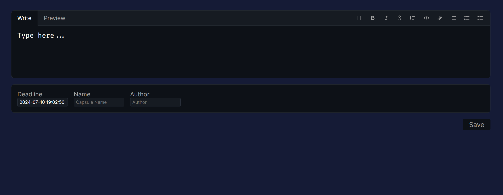
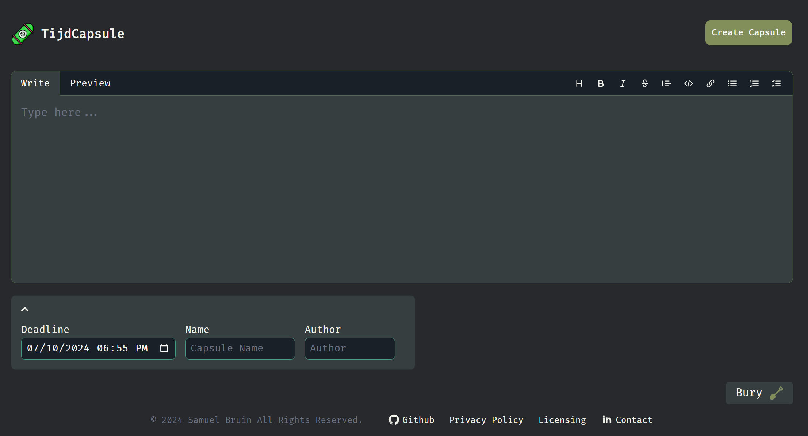

# TijdCapsule
A pastebin alternative with the option of setting a time lock on the content before being able to view it.

This project was made by **[Joey Li](https://github.com/einstein8612)** & **[Samuel Bruin](https://github.com/ancientkingg)**

TijdCapsule originally started out as a joke. When we were discussing ideas for a project, we thought it would be funny to make a pastebin alternative that would only show the content after a certain amount of time. The idea was swiftly turned into a project after a weekend crunch and originally looked like this:

After several weeks of the project being stale, mostly due to university, the app was revamped using the FlowBite Svelte UI Component Library and Tailwind CSS. The project now looks like this:

The project is deployed using Shuttle and can be found at [tijdcapsule.shuttleapp.rs](https://tijdcapsule.shuttleapp.rs)

## Features
- Create a time capsule with a time lock
- View time capsules

## Privacy
- All data is encrypted in the database using AES-256 and can only be decrypted using the key provided in the URL, which is not stored server-side.
- The data is stored in a PostgreSQL database and is only accessible by the server.
- The data is stored indefinitely unless the user requests deletion.

## Tech stack
- [Rust](https://www.rust-lang.org/)
- [Shuttle](https://www.shuttle.rs/)
- [Axum](https://github.com/tokio-rs/axum/)
- [Svelte](https://svelte.dev/)
- [Flowbite Svelte](https://flowbite-svelte.com/)
- [Tailwind CSS](https://tailwindcss.com/)

## Environment requirements
- `server/Secrets.toml`
    - DB_PASSWORD
    - COOKIE_KEY
- `server/.env`
    - DATABASE_URL
